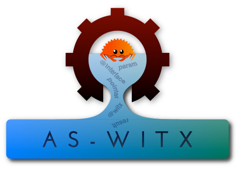

================================


[](https://crates.io/crates/witx-codegen)

# WITX-CodeGen: A WITX code and documentation generator

WITX is a way to describe types and function interfaces for WebAssembly modules.

From this, code generators can produce code to access data and call functions from different languages using the same layout and calling conventions.

The generated code is compatible with the WebAssembly standard APIs ([WASI](https://wasi.dev)).

This tool uses the next (as on April 5th, 2021) revision of the format definition, as implemented in the forthcoming version 0.10 of the Rust `witx` crate.

`witx-codegen` is written in Rust, but is language-agnostic. The output is meant to be simple to understand.

The tool can also produce different documentation formats.

`witx-codegen` supersedes `as-witx`, `zig-witx`, `witx-docgen`, `witx-overview-docgen` and `witx-generate-raw`.

## Installation

* Via `cargo`:

```sh
cargo install witx-codegen
```

* Precompiled binaries: tarballs and Debian/Ubuntu packages are available [here](https://github.com/jedisct1/witx-codegen/releases/latest).

## Usage

```text
WITX code generator for WebAssembly guest modules

USAGE:
    witx-codegen [FLAGS] [OPTIONS] <witx_files>...

FLAGS:
    -h, --help            Prints help information
    -H, --skip-header     Do not generate a header
    -I, --skip-imports    Ignores imported types and functions
    -V, --version         Prints version information

OPTIONS:
    -m, --module-name <module_name>
            Set the module name to use instead of reading it from the witx file

    -o, --output <output_file>         Output file, or - for the standard output
    -t, --output-type <output_type>
            Output type. One in: {assemblyscript, rust, overview, markdown}
            [default: assemblyscript]

ARGS:
    <witx_files>...    WITX files
```

## Backends

* [X] Markdown documentation ([example](https://github.com/jedisct1/witx-codegen/blob/master/example-output/markdown.md))
* [X] API Overview ([example](https://github.com/jedisct1/witx-codegen/blob/master/example-output/overview.txt))
* [X] AssemblyScript ([example](https://github.com/jedisct1/witx-codegen/blob/master/example-output/assemblyscript.ts))
* [X] Rust ([example](https://github.com/jedisct1/witx-codegen/blob/master/example-output/rust.rs))
* [ ] Zig
* [ ] TinyGo
* [ ] C/C++
* [ ] HTML documentation

## Example inputs

See the [`test`](https://github.com/jedisct1/witx-codegen/tree/master/test) folder for examples of WITX input files.

Other input formats may also be eventually supported.
